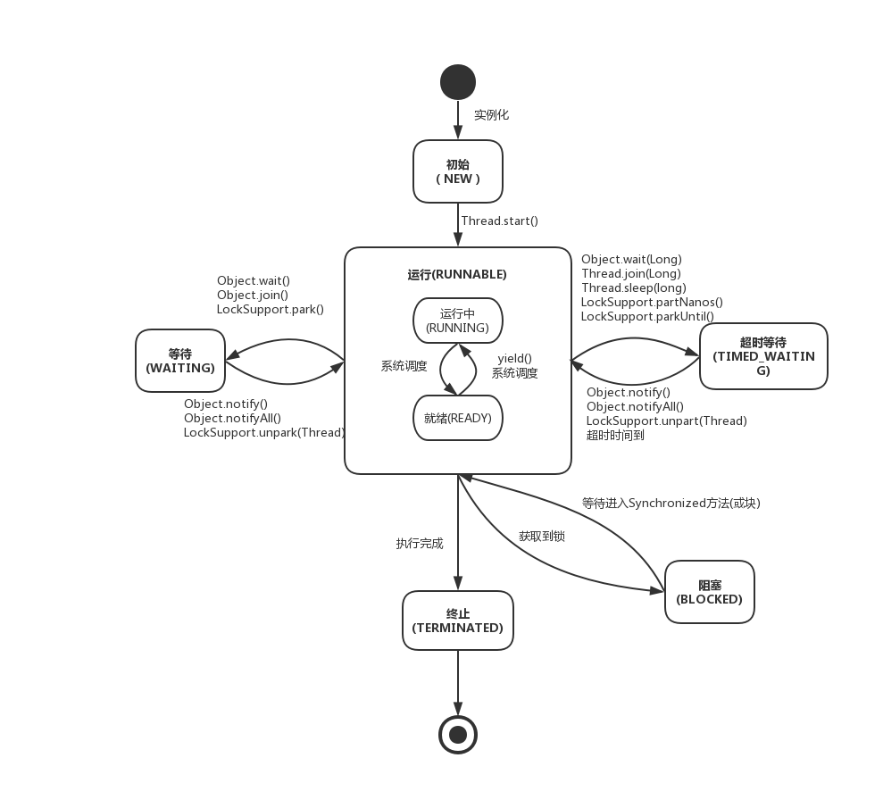

## 并发编程的艺术

此文看此书的大纲提要，本书作者写书是基于jdk1.7的，部分1.8的东西没有提到，比如ConcurrentHashMap是基于1.7的分段锁分析，1.8是去掉了分段锁，采用数组+链表+红黑树；比如原子类1.8增加了LongAdder，笔记中会稍作补充。

## 第一章  并发编程的挑战

### 上下文切换

### 死锁

### 资源限制

## 第二章  java并发机制的底层实现原理

### 2.1 volatile的应用

#### 	volatile的定义：

​	java允许线程访问共享变量，为了确保共享变量能被准确和一致的更新，线程应该通过排他锁的方式单独获取这个变量。java提供volatile在某些情况下比锁更方便。**如果一个字段被声明为volatile,java内存模型确保所有线程看到的这个变量的值都是一致的。**（保存可见性但是不保证原子性）

#### volatile的原理：

​	volatile如何保证可见性呢？例如: `instance = new Singleton(); //instance 为volatile变量` ,其编译后对应的汇编是 `movb xxxxxxxxx.. lock add1 xxx;` 有volatile修饰的共享变量编译后会生成有lock前缀的指令，lock前缀指令在多核处理器会引发两件事情：

1）将当前处理器的缓存行的数据会写回系统内存

2）这个写内存的操作会使在其他cpu里缓存了该内存地址的数据无效

#### volatile的优化

​	jdk7的并发包新增了一个队列集合类LinkedTransferQueue,在使用volatile变量时使用追加到64字节的方式来优化出队入队的性能。在某些处理器的高速缓存行是64字节宽，一个64字节的变量刚好占据一个缓存行，这样在加锁的时候只锁定一个变量，如果不是64字节，一个缓存行可能缓存多个变量，那么在加锁的时候就会锁定多个变量，可以避免头节点尾节点加载到一个缓存行。

### 2.2 synchronized的实现原理和应用

synchronized实现同步的基础：java中每一个对象都可以作为锁。具体表现为一下三种形式：

- 普通同步方法：琐是当前实例对象
- 静态同步方法：琐是当前类的class对象
- 同步代码块：锁是synchronized括号里面的对象

#### 2.2.1 java对象头

synchronized锁是存在java对象头里的。如果对现象是数组类型，则虚拟机用3个字宽存储对象头；如果对象是非数组类型，则用2字宽存储对象头。在32位虚拟机中1字宽等于4个字节。

| 长度        | 内容                   | 说明                         |
| ----------- | ---------------------- | ---------------------------- |
| 32bit/64bit | Mark Word              | 存储对象的hashCode和锁信息等 |
| 32bit/64bit | Class Metadata Address | 存储到对象类型数据的执政     |
| 32bit/64bit | Array Length           | 数组长度（如果是数组的话）   |

#### 2.2.2 锁的升级与对比

在java se1.6中，锁有四种状态：无锁状态 -> 偏向锁状态 -> 轻量级锁状态 -> 重量级锁状态。锁可以升级不能降级，这种策略是为了提升获取锁和释放锁的效率。

|    锁    |                             优点                             |                   缺点                   |            适用场景            |
| :------: | :----------------------------------------------------------: | :--------------------------------------: | :----------------------------: |
|  偏向锁  | 加锁和解锁不需要额外的消耗，和直接使用非同步方法仅仅村咋爱纳秒级的差别 | 在线程竞争的时候会带来额外的锁撤销的小号 |  只有一个线程访问同步块的场景  |
| 轻量级锁 |             竞争线程不会阻塞，提高程序的相应速度             |       得不到锁的线程会自旋小号cpu        | 追求相应时间，同步块执行时间短 |
| 重量级锁 |                竞争线程不会自旋，不会小号cpu                 |          线程阻塞，相应时间缓慢          |  追求吞吐量，同步块执行时间长  |

#### 2.2.3 原子操作的实现原理

##### 定义：不可中断的一个或一系列操作

##### 处理器如何实现原子操作

###### 表 CPU术语定义

| 术语名称     | 英文                   | 解释                                                         |
| ------------ | ---------------------- | ------------------------------------------------------------ |
| 缓存行       | cache line             | 缓存的最小操作单位                                           |
| 比较并交换   | compare and swrap      | CAS操作需要输入俩个值，一个旧值，一个新值，先用旧值比较，当旧的值一样才交换成新值，发生了变化则不交换 |
| CPU流水线    | CPU pipeline           | CPU流水线的工作方式就像工业生产上的装配流水线，在cpu中由5-6个不同的电路单元组成一条指令处理流水线，然后将一条x86指令分成5-6步后再由这些电路单元执行，这样旧能实现在一个时钟周期内完成一条指令，因此提高cpu的运算速度 |
| 内存顺序冲突 | Memory order violation | 内存冲突一般是由于假共享引起的，假共享是指多个cpu同时修改一个缓存行的不同部分而引起其中一个cpu的操作无效，当出现内存冲突是，cpu必须清空流水线 |

###### （1）使用总线锁保证原子操作

###### （2）使用缓存锁保证原子操作

由两种清空处理器会使用总线锁而不会使用缓存锁：1）当操作的数据不能缓存在处理器内部，或者操作的数据跨多个缓存行时，处理器调用总线锁定。2）有些处理器不支持缓存锁定。

##### java中如何实现原子操作

###### 使用锁和CAS来实现原子操作

###### 使用CAS实现原子操作：

自旋CAS的基本思路就是循环进行CAS操作知道成功为止。

CAS操作的三大问题：

（1）ABA问题：jdk1.5开始atomic包中AtomicStampedReference解决ABA问题

（2）循环时间长开销大：自旋cas如果长时间不成功，会给cpu带来非常大的开销。如果JVM支持处理器体提供的pause指令，效率会有一定的提高，pause指令有两个作用：延迟cpu执行指令，是cpu不会消耗过多的资源；避免在循环退出的时候因内存冲突引起流水线清空，提升cpu的执行效率。

（3）只能保证一个共享变量的原子操作。jdk1.5开始体提供AutomicReference保证引用对象之间的原子性。

###### 使用锁机制实现原子操作

jvm提供了多种锁机制：偏向锁，轻量级锁，互斥锁。除了偏向锁，其他锁都采用了CAS来时的方式实现。

## 第三章 java内存模型

###  java内存模型抽象结构示意图

## 第四章 并发编程（多线程）基础

### 4.1 线程简介

#### 什么是线程

现代操作系统在运行一个程序时，会为其创建一个进程。例如，启动一个Java程序，操作系统就会创建一个Java进程。现代操作系统调度的最小单元是线程，也叫轻量级进程（Light WeightProcess），在一个进程里可以创建多个线程，这些线程都拥有各自的计数器、堆栈和局部变量等属性，并且能够访问共享的内存变量。处理器在这些线程上高速切换，让使用者感觉到这些线程在同时执行。

#### 为什么要使用多线程

更多的处理器核心：一个线程一个时刻只能运行在一个处理器核心上

更快的响应时间：异步处理，缩短响应时间，提升用户体验

更好的编程模型：使开发人员更好的专注于问题的解决，即为所遇到的问题建立合适的模型，而不是绞尽脑汁的考虑如何将其多线程化

#### 线程优先级

现代操作系统基本采用时分的形式调度运行的线程，操作系统会分出一个个时间片，线程会分配到若干时间片，当线程的时间片用完了就会发生线程调度，并等待着下次分配。线程 分配到的时间片多少也就决定了线程使用处理器资源的多少，而线程优先级就是决定线程需 要多或者少分配一些处理器资源的线程属性。 

在Java线程中，通过一个整型成员变量priority来控制优先级，优先级的范围从1~10，在线 程构建的时候可以通过setPriority(int)方法来修改优先级，默认优先级是5，优先级高的线程分 配时间片的数量要多于优先级低的线程。设置线程优先级时，针对频繁阻塞（休眠或者I/O操 作）的线程需要设置较高优先级，而偏重计算（需要较多CPU时间或者偏运算）的线程则设置较 低的优先级，确保处理器不会被独占。在不同的JVM以及操作系统上，线程规划会存在差异， 有些操作系统甚至会忽略对线程优先级的设定。

**线程优先级不能作为程序正确性的依赖，因为操作系统可以完全不用理会Java 线程对于优先级的设定。**

#### Daemon线程

Daemon线程是一种支持型线程，因为它主要被用作程序中后台调度以及支持性工作。这 意味着，当一个Java虚拟机中不存在非Daemon线程的时候，Java虚拟机将会退出。可以通过调 用Thread.setDaemon(true)将线程设置为Daemon线程。

#### 线程的状态

